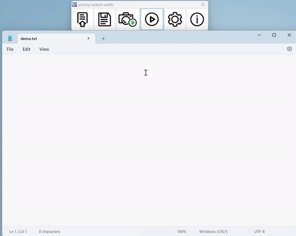

# johnny-action-smith

Allows users to record their mouse and keyboard actions and reproduce them identically as many times as they wants.

# Hotkey List
- esc: Stop recording (Notice that this is the only to stop recording in order to add accuracy of the action, and users can change this hotkey in settings list)
- enter: Playback (Again, users can change this hotkey in settings list)
- Ctrl+p: Force Quit (Users can force to break the loop. Importantly, users should HOLD ctrl + p UNTIL the message dialog shows on the screen and you can release them. It's the only way to break the inifinite loop since the mouse is controlled by the program and it will be hard to close the button brutely by mouse) 
- Ctrl+s: Save Recording / Capture to Script
- Ctrl+o: Open Script 
- Ctrl+r: Set repeat times

# Application
It's elegant to automate farming / repeating actions in games/ message sending if it needs to be repeated for a long time, and the script can be download and replay 

# Install instructions
You can download and run the installer/archive for your operating system (currently Windows ONLY, since I have no Linux laptop, if someone could help me to wrap up the project in Linux, I will highly appreciate you and grab a cup of coffee to you!) 
from [here](https://github.com/Johnnyallen07/Mouse_Keyboard_Action_Recording/releases/tag/1.0.0)

# Demo

# Tips
-When the user downloading the .exe, it might say that the .exe file is suspicious and might be a malware, because I have no proper license. Don't worry, just go ahead and normally install it! (Trust me)
-BTW, the reference or the thought of the project is derived from atbswp: https://github.com/RMPR/atbswp; and the UI image is drawn by my friend: Andy. Thanks for the contribution to this project!
-If any problem emerges, please contact me ASAP or the email: johnnyallenyxc@gmail.com 
